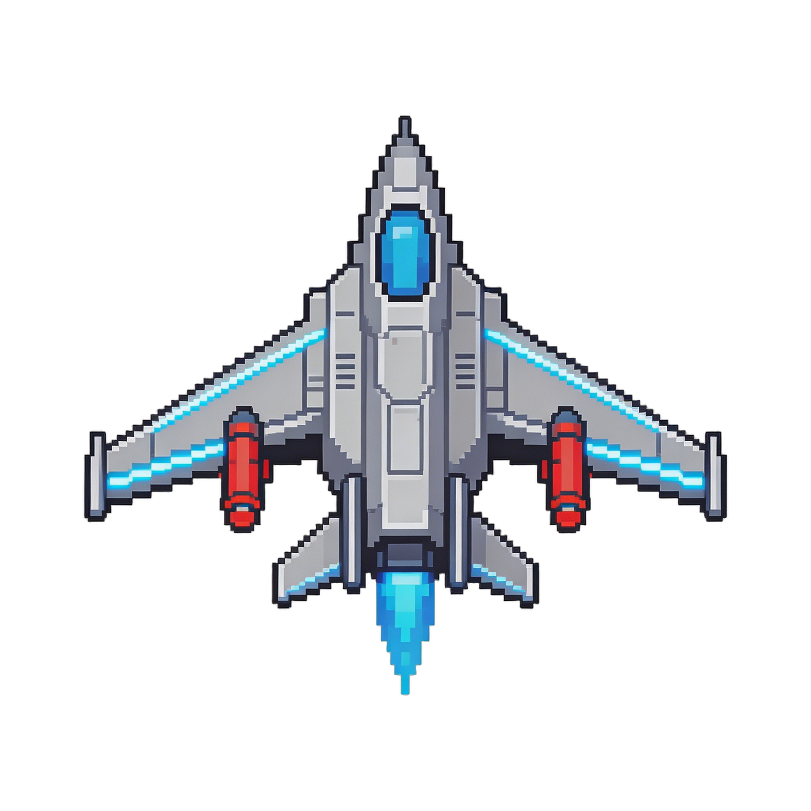
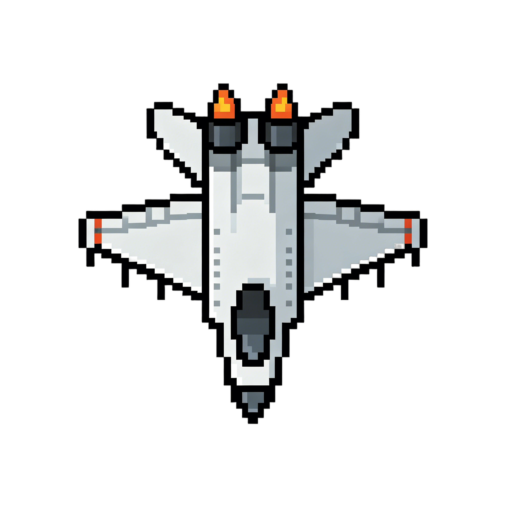
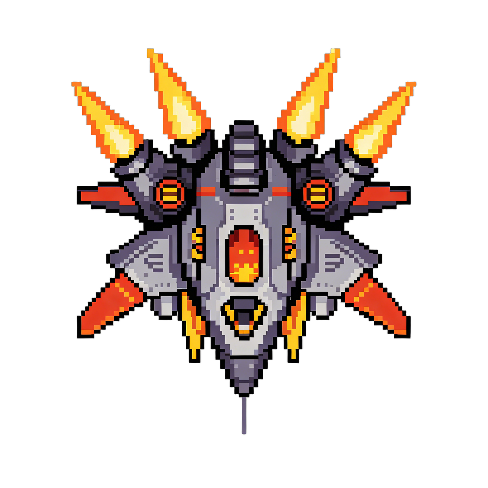
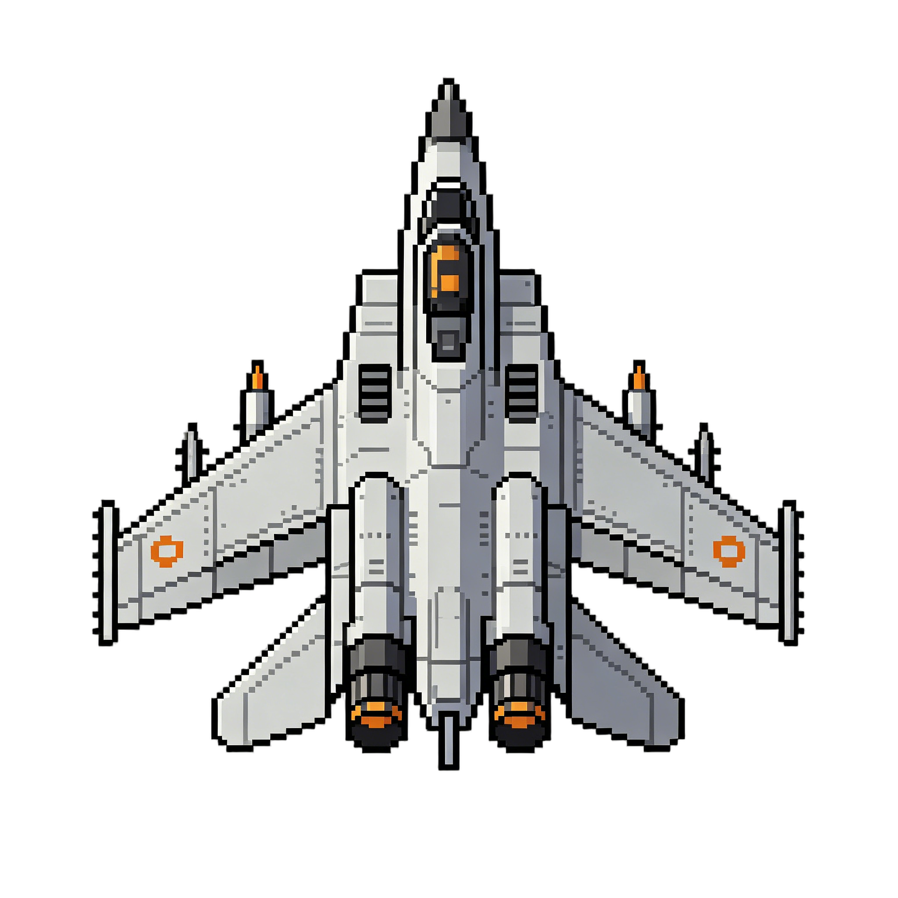
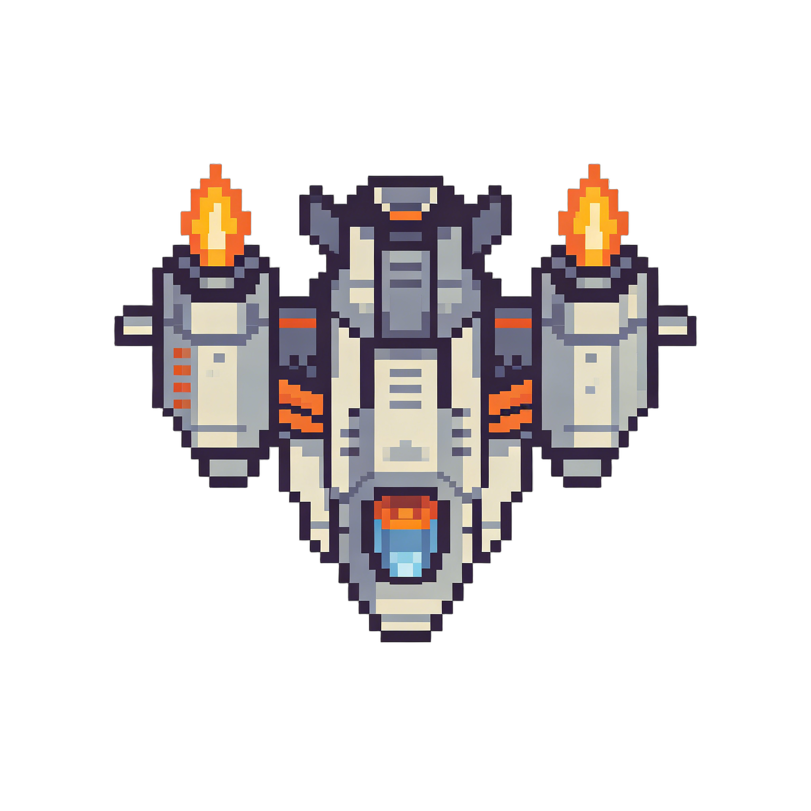
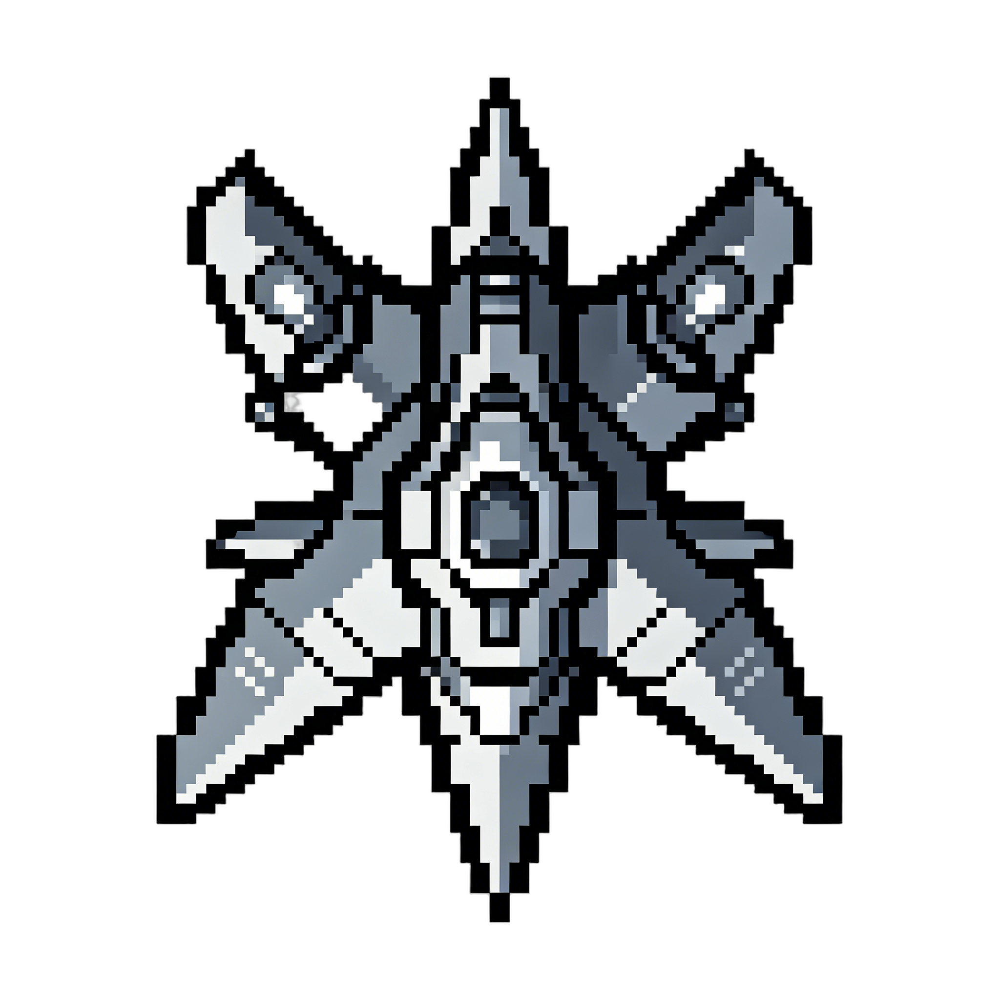
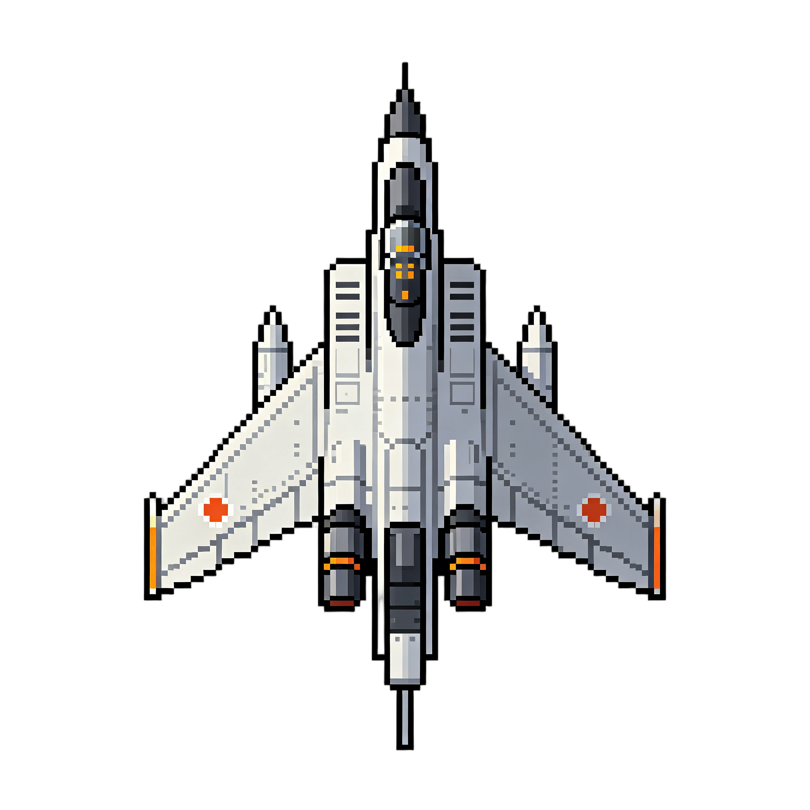
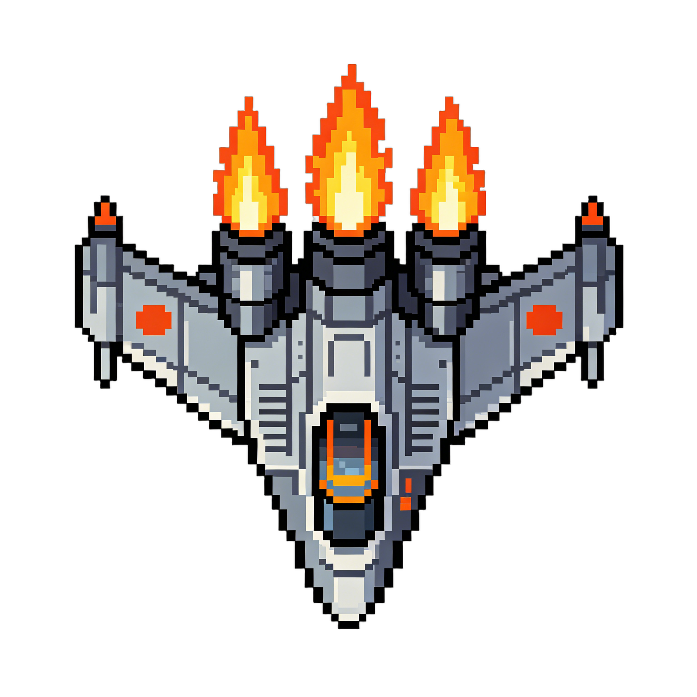
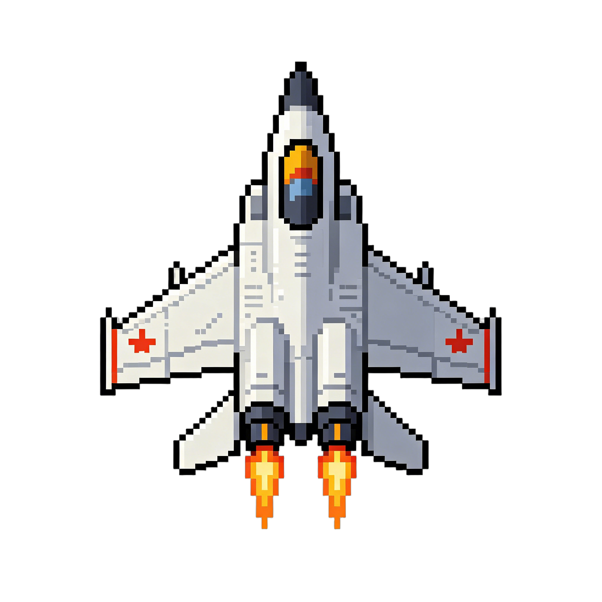
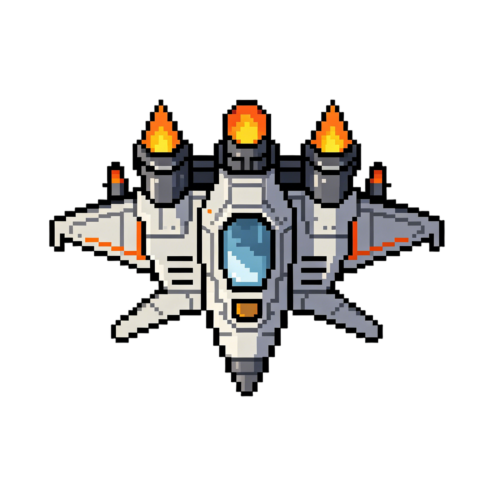

# ⚡ 雷霆战机 (Thunder Fighter Jet)

<p align="center">
  
</p>

<p align="center">
  <strong>Java 竖版射击游戏 | 经典街机复刻 | 面向对象课程设计</strong>
</p>

<p align="center">
  
  
  
  
</p>

---

## 📖 目录

- [项目简介](#项目简介)
- [核心特性](#核心特性)
- [游戏截图](#游戏截图)
- [系统架构](#系统架构)
- [游戏机制](#游戏机制)
  - [玩家飞机](#玩家飞机)
  - [敌机系统](#敌机系统)
  - [子弹系统](#子弹系统)
  - [破甲机制](#破甲机制)
  - [升级与技能](#升级与技能)
  - [波次与 Boss](#波次与-boss)
- [操作指南](#操作指南)
- [快速开始](#快速开始)
- [项目结构](#项目结构)
- [技术栈](#技术栈)
- [设计模式](#设计模式)
- [开发计划](#开发计划)
- [项目成员](#项目成员)
- [扩展规划](#扩展规划)

---

## 项目简介

**雷霆战机 (Thunder Fighter Jet)** 是一款使用 **Java** 语言开发的经典竖版射击游戏，复刻了街机时代飞行射击游戏的核心玩法。项目采用面向对象设计，遵循分层架构，实现了完整的飞机选择、敌机 AI、弹幕系统、破甲机制、升级卡牌系统、技能系统、波次管理和 Boss 战等丰富内容。

本项目同时是一次面向对象编程与游戏开发的综合实践（课程设计）。

---

## 核心特性

- **4 种可选玩家飞机** — 雷霆（均衡型）、疾风（高速型）、破甲（重甲型）、追猎（追踪型），各有独特初始属性
- **敌机 AI 系统** — 4 个等级敌机，支持直线下降、正弦波、折线、追踪摇摆等多种移动模式
- **3 种子弹类型** — 普通子弹（直线）、穿甲弹（高穿透）、追踪导弹（惯性制导），暴击率各有不同
- **破甲机制** — 子弹穿甲值与敌机护甲值实时对比计算，影响伤害与暴击率，支持 8 档压/制/阻判定
- **Roguelike 升级系统** — 击杀敌机获取经验 → 自动升级 → 基础属性成长 → 3 选 1 升级卡
- **34 张升级卡** — 9 张技能卡 + 9 张飞机升级卡 + 16 张武器升级卡，正负混搭策略选择
- **10 波敌机波次** — 波次难度递进，固定比例混合出怪，每波约 30 秒
- **双 Boss 战** — Wave 5 雷霆先锋（30 万 HP）+ Wave 10 雷霆霸主（50 万 HP），各自 3 阶段切换
- **Buff 掉落系统** — 治疗（+800 HP）/ 护盾（+300 虚拟护甲）/ 火力（射速翻倍），彩色 Buff 球自动掉落
- **序列帧动画** — 飞机动态效果，基于时间差的帧切换

---

## 游戏截图


| 玩家飞机 | 敌方飞机 | Boss 战 |
|----------|---------|---------|
|  |  |  |
|  |  |  |
|  |  | --------- |
|  |  | --------- |

---

## 系统架构

项目采用 **分层架构** 设计，清晰分离关注点：

```
┌─────────────────────────────────────────┐
│         表现层 (Presentation)             │
│    GamePanel — JFrame 窗口绘制            │
├─────────────────────────────────────────┤
│         控制层 (Controller)               │
│  GameEngine / InputControl / EventControl│
├─────────────────────────────────────────┤
│         实体层 (Entity)                   │
│   Plane / Bullet / Skill / Buff          │
├─────────────────────────────────────────┤
│         接口层 (Interface)                │
│ PlayerActionListener / EnemyActionListener│
│          GameEventListener               │
└─────────────────────────────────────────┘
```

**数据流：**  
`键盘输入 → InputControl → PlayerActionListener → PlayerPlane（实体更新）`  
`AI 决策 → EnemyActionListener → EnemyPlane（自主行为）`  
`游戏事件 → EventControl（观察者模式） → 各模块解耦响应`

---

## 游戏机制

### 玩家飞机

开局可从 4 种飞机中选择 1 架出战：

| 飞机 | 类型 | HP | 护甲 | 移速 | 初始子弹 |
|------|------|-----|------|------|----------|
| 雷霆 | 均衡型 | 3000 | 50 | 5.0 | 普通子弹 |
| 疾风 | 高速型 | 2500 | 30 | 7.0 | 普通子弹 |
| 破甲 | 重甲型 | 4000 | 80 | 3.5 | 穿甲弹 |
| 追猎 | 追踪型 | 2800 | 40 | 5.5 | 追踪导弹 |

> **每级成长：** 每次升级时，子弹伤害、生命值、穿甲值均 **+10%**（乘法叠加），先于升级卡生效。

### 敌机系统

| 等级 | 名称 | 图片 | HP | 护甲 | 移速 | 子弹类型 |
|------|------|------|-----|------|------|----------|
| Lv.1 | 基础杂兵 | `normalAnemyJet1` | 500 | 10 | 2.0 | 单发直射 |
| Lv.2 | 机动型 | `normalAnemyJet2` | 1500 | 30 | 3.0 | 2 路扩散 |
| Lv.3 | 精英型 | `normalAnemyJet3` | 3000 | 80 | 2.5 | 3 路扇形 |
| Lv.4 | 王牌型 | `normalAnemyJet4` | 5000 | 150 | 3.5 | 3 路 + 穿甲弹 |

### 子弹系统

| 子弹类型 | 基础伤害 | 射速 | 穿甲值 | 初始暴击率 | 特色 |
|----------|----------|------|--------|------------|------|
| 普通子弹 | 300 | 0.5s/发 | 10 | 0% | 直线弹道 |
| 穿甲弹 | 400 | 0.4s/发 | 20 | 10% | 高穿透 |
| 追踪导弹 | 500 | 1.0s/发 | 15 | 20% | 惯性制导追踪 |

> **暴击机制：** 触发暴击时，实际伤害 = 基础伤害 × (1 + 随机 100%~300%)，即 200%~400% 最终伤害。

### 破甲机制

子弹穿甲值与敌机护甲值对比，共 8 档判定，影响最终伤害和暴击率：

| 穿甲比 | 伤害修正 | 暴击率修正 | 效果 |
|--------|----------|------------|------|
| > 2.0 倍 | **+100%** | **+100%** | 完全压制 |
| 1.6~2.0 倍 | +60% | +50% | 强力穿透 |
| 1.3~1.6 倍 | +30% | +30% | 有效穿透 |
| 1.0~1.3 倍 | +15% | +20% | 轻微穿透 |
| 0.8~1.0 倍 | -10% | -20% | 轻微受阻 |
| 0.7~0.8 倍 | -20% | -35% | 中度受阻 |
| 0.5~0.7 倍 | -30% | -60% | 严重受阻 |
| < 0.5 倍 | **-50%** | **-80%** | 几乎无法穿透 |

### 升级与技能

**升级流程：**
```
击杀敌机 → 获得经验 → 达到阈值自动升级
                         ↓
               基础属性成长（各 +10%）
                         ↓
             弹出升级卡界面（随机 3 选 1）
                         ↓
              每 5 级额外获得 1 张技能卡
```

**升级卡分类（共 34 张）：**

| 类别 | 数量 | 示例 |
|------|------|------|
| 技能卡 | 9 张 | 雷霆瞬闪（无敌闪避）、电磁护盾、聚变爆破（全屏清屏）、能量虹吸（8% 吸血）等 |
| 飞机卡 | 9 张 | 不灭血核（HP+40% 护甲+50% 移速-50%）、破空狂躯（移速+100%）等 |
| 武器卡 | 16 张 | 锐击弹芯、湮灭重弹（伤害+200%）、暗能追猎（切导弹）、暴雨弹潮（子弹+3）等 |

> 技能槽上限 3 个，主动技能具有冷却时间（CD）。

### 波次与 Boss

| 波次 | 敌机组成 | 说明 |
|------|----------|------|
| Wave 1~3 | Lv.1 (100%) | 基础适应 |
| Wave 4 | Lv.1 + Lv.2 (4:1) | 引入机动型 |
| **Wave 5** | Lv.1~3 + Boss 1 | **雷霆先锋 Boss 战** |
| Wave 6~9 | Lv.1~4 混合 | 难度递进 |
| **Wave 10** | Lv.1~4 + Boss 2 | **雷霆霸主 最终 Boss** |

**Boss 特点：**
- **Boss 1 — 雷霆先锋**（30 万 HP，护甲 100）：扇形弹幕 + 周天环形弹幕 + 冲撞技 + 双旋转弹幕
- **Boss 2 — 雷霆霸主**（50 万 HP，护甲 200）：扇形弹幕 + 双旋转弹幕 + 延迟爆炸弹 + 巨型蓝弹 + 生命恢复
- 双 Boss 均含 **三阶段切换**（HP ≤ 66% / ≤ 20%），每阶段弹幕模式变化
- 弹幕颜色区分：黄色/橙色基础弹幕、红色环形/爆炸弹、蓝色旋转/贯穿弹

**Buff 掉落：**

| Buff | 效果 | 持续时间 | 颜色 |
|------|------|----------|------|
| 治疗 | +800 HP | 即时 | 🔴 红色 |
| 护盾 | +300 虚拟护甲 | 10s | 🔵 蓝色 |
| 火力 | 射速翻倍（最高 Lv.3） | 8s | 🟡 黄色 |

---

## 操作指南

| 按键 | 操作 |
|------|------|
| `↑` / `W` | 向上移动 |
| `↓` / `S` | 向下移动 |
| `←` / `A` | 向左移动 |
| `→` / `D` | 向右移动 |
| `Space` | 射击 |
| `J` | 自动开火（开关切换） |
| `1` / `2` / `3` | 使用技能（对应技能槽） |
| `ESC` | 暂停 / 菜单 |

---

## 快速开始

### 环境要求

- **JDK 17+**（推荐 JDK 21）
- 任何支持 Java 的 IDE（IntelliJ IDEA / Eclipse / VS Code）

### 编译运行

```bash

javac -encoding UTF-8 -d out src/Main.java src/Entity/**/*.java src/Controller/**/*.java src/Controller/Coreiterface/*.java

java -cp out Main
```

或直接在 IDE（IntelliJ IDEA / Eclipse）中导入项目，运行 `src/Main.java`。

> **注意：** 运行前请确保 `src/image/` 目录中的图片资源完整。

---

## 项目结构

```
Thunder_Fighter_Jet/
├── README.md
├── 01设计文档.md                    # 完整设计文档
├── 02-敌机配置表.md                 # 敌机属性配置
├── 03.升级卡表.md                   # 升级卡详细数值
├── bug.md                          # 已知问题记录
├── src/
│   ├── Main.java                   # 程序入口
│   ├── TestBossVisual.java         # Boss 视觉测试
│   ├── Entity/                     # 实体层
│   │   ├── Plane/
│   │   │   ├── Plane.java          # 飞机抽象基类
│   │   │   ├── PlayerPlane.java    # 玩家飞机
│   │   │   └── EnemyPlane.java     # 敌机 (AI 控制)
│   │   ├── Bullet/
│   │   │   ├── Bullet.java         # 子弹抽象基类
│   │   │   ├── NormalBullet.java   # 普通子弹
│   │   │   ├── ArmorBullet.java    # 穿甲弹
│   │   │   └── MissileBullet.java  # 追踪导弹
│   │   ├── Skill/
│   │   │   └── Skill.java          # 技能抽象基类
│   │   └── Buff/
│   │       ├── Buff.java           # 增益效果抽象基类
│   │       └── BuffDrop.java       # 掉落 Buff 球
│   ├── Controller/                 # 控制层
│   │   ├── CoreController/
│   │   │   ├── GameEngine.java     # 游戏主循环引擎
│   │   │   ├── GamePanel.java      # 游戏界面 (JFrame)
│   │   │   ├── InputControl.java   # 键盘输入处理
│   │   │   ├── EventControl.java   # 事件监听/分发
│   │   │   └── GameEvent.java      # 游戏事件定义
│   │   └── Coreiterface/
│   │       ├── PlayerActionListener.java  # 玩家操作接口
│   │       ├── EnemyActionListener.java   # 敌机 AI 接口
│   │       └── GameEventListener.java     # 游戏事件接口
│   └── image/                      # 图片资源
│       ├── playerJet1~4.png        # 玩家飞机（4 张）
│       ├── normalAnemyJet1~4.png   # 普通敌机（4 张）
│       └── BossJet1~2.png          # Boss 敌机（2 张）
└── out/                            # 编译输出（.class 文件）
```

---

## 技术栈

| 技术 | 用途 |
|------|------|
| **Java** | 核心开发语言 |
| **Swing (JFrame)** | GUI 窗口框架 |
| **AWT (Graphics, KeyEvent, BufferedImage)** | 底层图形绘制、图片加载、键盘事件 |
| **序列帧动画** | 基于时间差帧切换的飞机动态效果 |

---

## 设计模式

| 模式 | 应用位置 | 说明 |
|------|----------|------|
| **观察者模式** | `EventControl` + `GameEventListener` | 游戏事件解耦分发 |
| **策略模式** | 敌机 AI 行为（`MovePattern`） | 不同移动策略可插拔 |
| **状态机模式** | Boss 多阶段切换 / 波次管理 | 状态驱动行为变化 |
| **抽象类 + 多态** | `Plane`, `Bullet`, `Skill`, `Buff` | 统一接口，子类差异化实现 |
